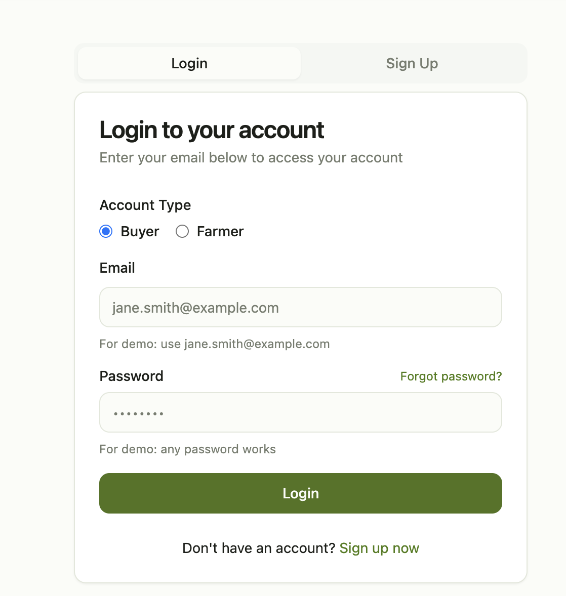
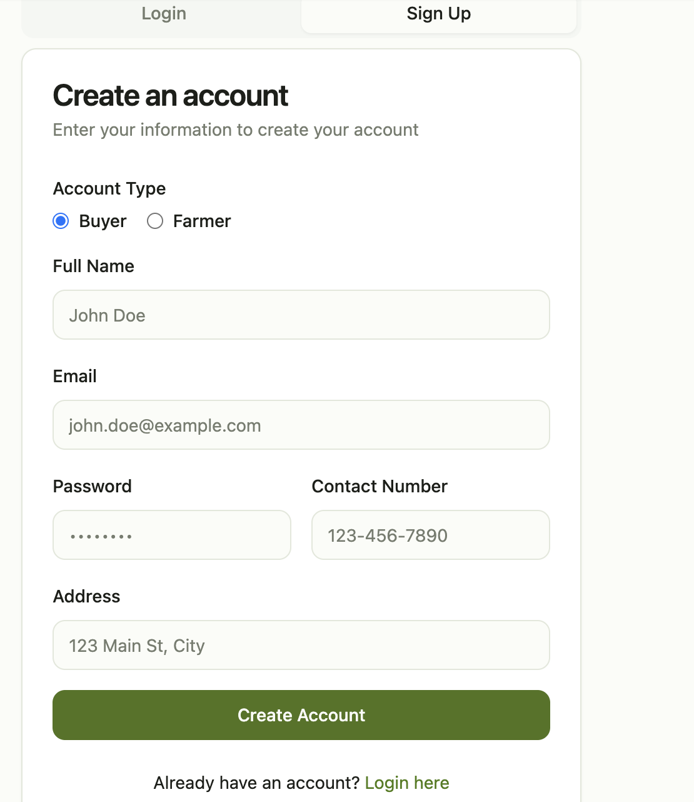
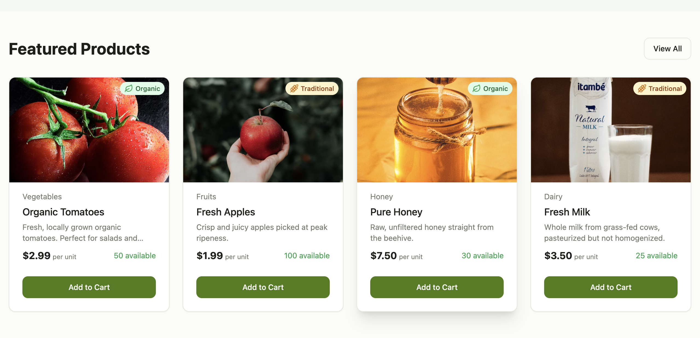
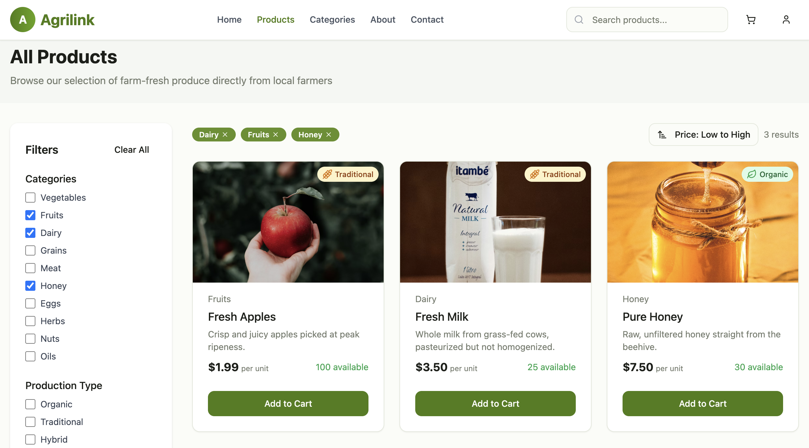
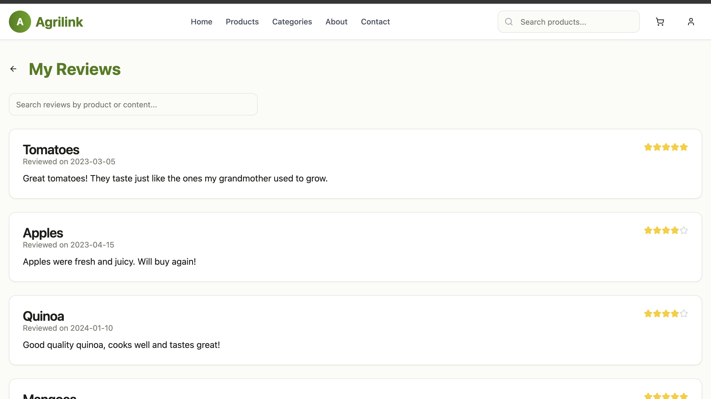
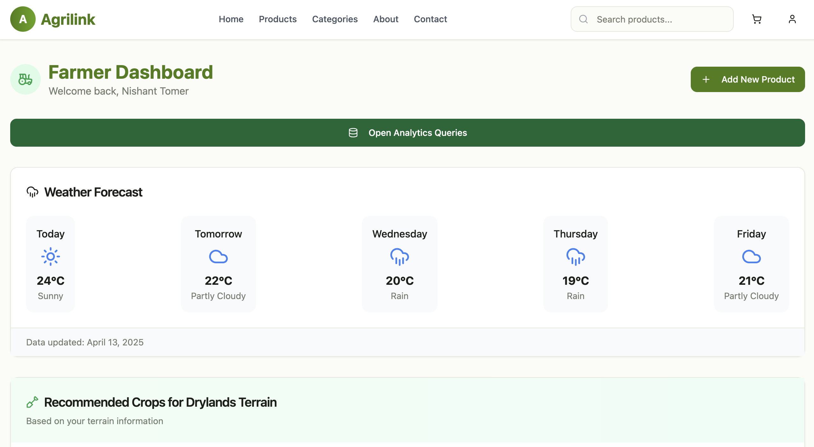
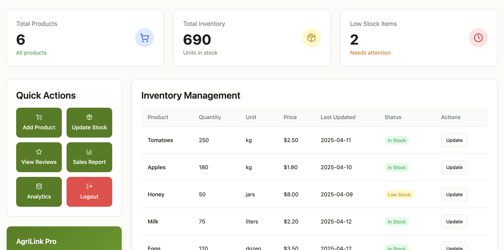
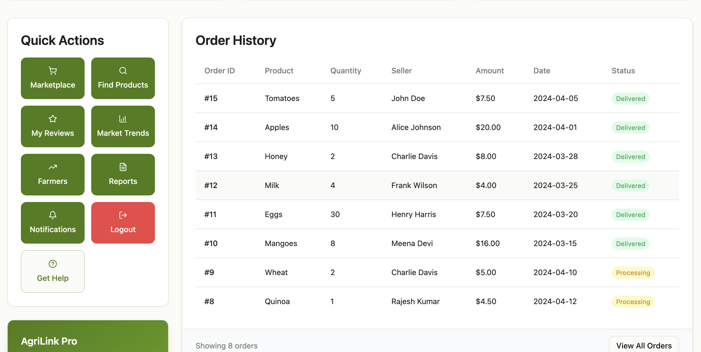
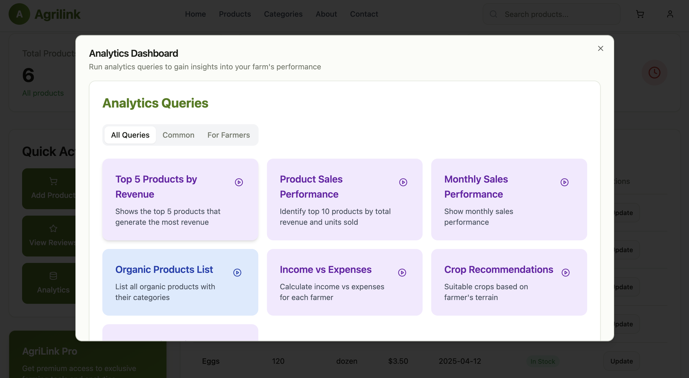
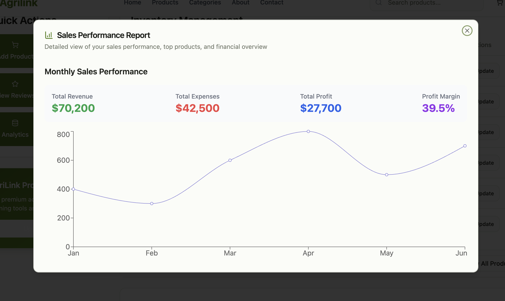

# AgriLink Harvest Hub 🌾

**A Full-Stack D2C Agricultural Marketplace & Supply Chain Solution**

AgriLink Harvest Hub is a professional-grade web application designed to bridge the gap between farmers and consumers. By eliminating intermediaries, the platform optimizes the agricultural supply chain, ensuring better profit margins for farmers and fresher produce for buyers.

---

## 🚀 Technical Overview

This project demonstrates a scalable **Full-Stack architecture** with a focus on type-safety, efficient state management, and relational data integrity.

* **Direct D2C Bridge:** Facilitates peer-to-peer transactions reducing supply chain overhead.
* **Data Integrity:** Implements a structured relational schema to handle complex multi-actor workflows (Farmers, Buyers, Logistics).
* **Modern Development:** Built with a focus on performance using Vite and robust server-state management via TanStack Query.

---

## 📸 Application Gallery

### Authentication & Access Control
<p align="center">
  
  
</p>

### Buyer Experience & Marketplace
<p align="center">
  
  
</p>
<p align="center">
  
</p>

### Farmer Dashboard & Order Management
<p align="center">
  
  
</p>
<p align="center">
  
</p>

### Advanced Analytics & Reporting
<p align="center">
  
  
</p>

---

## 🛠️ Technologies & Tools

### Frontend
* **React 18 & Vite**: Component-based UI with a high-performance build pipeline.
* **TypeScript**: End-to-end type safety for scalable and maintainable code.
* **Tailwind CSS & Shadcn/UI**: Utility-first styling and accessible, modern UI components.
* **TanStack Query**: Efficient data fetching, caching, and server-state synchronization.
* **React Router**: Declarative client-side routing.

### Backend & Database
* **Node.js & Express**: Scalable REST API architecture.
* **Supabase**: Backend-as-a-Service for real-time APIs and secure authentication.
* **Sequelize & MySQL**: Relational Data Modeling and ORM management for complex queries.
* **JWT**: Secure session-based authentication and Role-Based Access Control (RBAC).

---

## ✨ Key Features

* **Farmer Dashboard:** Comprehensive suite for inventory management (CRUD), sales analytics, and order fulfillment.
* **Buyer Portal:** Seamless product discovery with real-time filtering, ordering, and tracking.
* **Secure Authentication:** Multi-role login system for Farmers and Buyers.
* **Responsive Design:** Optimized experience across mobile, tablet, and desktop devices.
* **Real-time Data:** Instant UI updates leveraging Supabase real-time listeners.

---

## ⚙️ Getting Started

### Prerequisites
* **Node.js**: v16+ recommended
* **Package Manager**: npm or yarn
* **Database**: Access to a MySQL instance or Supabase project

### Installation & Setup

1. **Clone the Repository:**
   ```bash
   git clone [https://github.com/Nishant7p/AgriLink-FullStack-DBMS.git](https://github.com/Nishant7p/AgriLink-FullStack-DBMS.git)
   cd AgriLink-FullStack-DBMS
   ```

2. **Install Dependencies:**
   ```bash
   npm install
   ```

3. **Environment Configuration:**
   Create a `.env` file in the root directory and add your specific database and API credentials.

4. **Launch Development Server:**
   ```bash
   npm run dev
   ```
   *The application will be accessible at http://localhost:5173*

---

## 🤝 Credits & Contribution

This project was developed as a comprehensive demonstration of DBMS integration and Full-Stack development.
* **Developer:** [Nishant](https://github.com/Nishant7p)

---
*Developed as part of the CSAM curriculum at IIIT Delhi.*
